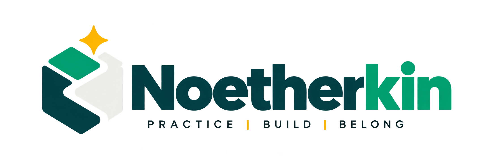

<p align="center">
  <picture>
    <source media="(prefers-color-scheme: dark)" srcset="./noetherkin-logo.png">
    <source media="(prefers-color-scheme: light)" srcset="./noetherkin-logo-light.png">
    
  </picture>
</p>

<h1 align="center">Noetherkin</h1>

<p align="center">
  Learn software engineering inside real codebases with portable mentoring workflows, evidence-based progression, and the learner firmly in control.
</p>

<p align="center">
  
  <a href="https://github.com/nanaagyei/noetherkin/actions/workflows/ci.yml"></a>
  <a href="https://github.com/nanaagyei/noetherkin/actions/workflows/codeql.yml"></a>
  
  
  
  <a href="./LICENSE"></a>
</p>

> [!NOTE]
> Noetherkin is currently in pre-release.

## What is Noetherkin?

Noetherkin is an agent-agnostic apprenticeship protocol and local CLI for practicing engineering through real open-source systems. It surrounds learner-authored work with onboarding, investigation, task assignment, progressive assistance, design review, code review, evidence capture, performance review, and promotion discipline.

The name combines Emmy Noether's mathematical legacy with *kin*: people learning and building as a community.

The project is built around one principle:

> The learner is the engineer. Agents support judgment and understanding; they do not replace the work that creates them.

Noetherkin currently includes:

- a frozen V1 product foundation with wire protocol 3.0;
- a deterministic, recoverable local state publisher;
- 21 portable [Agent Skills](docs/skills.md);
- 34 versioned learning tracks, 87 project catalog entries, and four draft forge specifications (Eval Ledger, Accessible Data Table, SLO Burn Report, Batch Ingest) that E0 to E2 learners build from empty;
- an advisory competency graph and a map-first context budget;
- generic, Codex, and Claude Code capability adapters, and Codex or Claude Code role adapters;
- evidence, assistance, review, and promotion semantics designed to resist fabricated progress.

## Why it exists

Most coding-agent workflows optimize for finishing the ticket. Noetherkin optimizes for the learner becoming able to explain, debug, modify, test, operate, and defend the system independently.

```text
READ → MAP → BUILD → RUN → TRACE → BREAK → DEBUG
     → TEST → MODIFY → BENCHMARK → OPERATE → EXPLAIN
```

Progress is based on attributable evidence, not points, streaks, task counts, or conversational impressions. Self-report can guide onboarding, but it cannot establish demonstrated capability or grant promotion.

## Install

Noetherkin has two parts: a trusted local CLI that owns workspace state, and portable skills that teach your AI agent how to take part. The CLI installs the skills for you. It needs Node.js 24 or newer and Git.

1. **Install the CLI** from the latest release:

   ```sh
   npm install -g https://github.com/nanaagyei/noetherkin/releases/latest/download/noetherkin.tgz
   ```

   This puts `noetherkin` on your PATH. Rerun the same command to update. Noetherkin is not on the npm registry; each GitHub release carries the package as `noetherkin.tgz`, with a `.sha256` checksum beside it.

2. **Run setup** from the directory you want to learn in:

   ```sh
   noetherkin setup
   ```

   Setup checks your machine (Node, Git, and an agent CLI such as Claude Code or Codex for role judgments), offers to install the skills for every agent it finds, and offers to start a workspace. Every step asks first, and it is safe to rerun.

3. **Open your agent** in that directory and ask it to use the Noetherkin onboarding skill.

To work on Noetherkin itself, clone it instead: `git clone https://github.com/nanaagyei/noetherkin.git`, then `npm install` (which builds) and `npm link`. Don't use `npm install -g github:nanaagyei/noetherkin`: under npm 11 a git-URL global install links a temporary clone and leaves a broken install. To install the skills without setup, run `noetherkin skills install` (add `--global` for your user account, or `--target <dir>` for one project). It verifies every file digest and never overwrites an existing file. `npx skills add nanaagyei/noetherkin` also works with the [Skills CLI](https://github.com/vercel-labs/skills).

The skills teach an agent how to take part. The CLI is what writes state: it owns validation, consent, transactions, and every canonical record. An agent proposes; the CLI publishes.

## Start a workspace

`noetherkin setup` can do this for you. By hand:

```sh
mkdir my-apprenticeship && cd my-apprenticeship
noetherkin init                  # review, then type "initialize"
noetherkin tracks                # which tracks have a runnable path
noetherkin track select frontend-engineering
noetherkin onboard               # records an all-unassessed baseline
noetherkin next                  # prints the exact next command to run
```

Commands find the nearest workspace above the current directory; pass `--workspace <dir>` to choose another. Initialization and other consent steps need you at a terminal. Commands that need a role judgment use the first working agent CLI (Codex, then Claude Code); choose one with `--role-adapter claude` or `NOETHERKIN_ROLE_ADAPTER=claude`. A track guides recommendations but never owns skills, evidence, or promotion decisions. `next` also shows an advisory block naming which competencies to look at first and which forge or project exercises them; it is derived, not evidence, and gates nothing. Every command supports `--json` and `--help`; see the [CLI and recovery guide](docs/cli.md).

Twelve tracks have a runnable path today: forge projects you build from an empty directory (Eval Ledger, Accessible Data Table, SLO Burn Report, Batch Ingest, all still `draft`) and the curated Spring PetClinic task. The other tracks use the portable task-assignment skill on any attachable catalog project.

## Where everything lives

Noetherkin has three parts, and each lives in one place:

| Part | Where it lives | How often you install it |
| --- | --- | --- |
| The `noetherkin` CLI | Your global npm packages, installed from the release tarball | Once per machine |
| The agent skills | `~/.claude/skills` (Claude Code) and `~/.agents/skills` (Codex), or one folder with `--target` | Once per machine |
| Your workspace | A folder you choose. Its `.apprenticeship/` subfolder is your record | Once per apprenticeship |

You never install Noetherkin into a project, including an open-source repository. The code you work on lives **inside** your workspace, next to your record:

```text
~/apprenticeship/                      your workspace: open your agent here
├── .apprenticeship/                   your record; only the CLI writes it
├── accessible-data-table/             a forge project: your own new Git repository
└── spring-petclinic-microservices/    an open-source clone, if you attach one
```

- **Forge projects.** You build these from nothing. `noetherkin project select accessible-data-table --source accessible-data-table` binds an empty folder in the workspace. You run `git init` there and write every line yourself. Nothing is cloned.
- **Open-source projects.** `noetherkin project select <project-id> --clone-to <folder>` clones a catalog project into the workspace after you confirm. `--source <folder>` attaches a clean clone you already put there. Noetherkin pins the commit and never pushes, and your clone stays free of Noetherkin files. Spring PetClinic has a curated task pack. Other attachable projects get their tasks from the portable task-assignment skill.

One workspace follows one learner through tracks and projects. A later project goes into the same workspace, so your evidence and history carry forward.

## Working with an AI agent

Open your agent (Claude Code, Codex, or another agent that supports skills) in the workspace folder or any folder inside it, and ask naturally:

> Use Noetherkin. Where am I in my apprenticeship, and what should I do next?

What happens in each session:

1. **The agent reads your state.** The skills tell it to run `noetherkin status --json` and `noetherkin next --json`. The CLI finds the workspace by walking up from the current folder, so a session opened inside your project folder works too.
2. **The agent teaches.** It mentors, reviews and asks questions within your assistance ceiling. It does not write your code unless you explicitly ask. Help you request through `noetherkin task help` is recorded against the task, so reviews can weigh it.
3. **You approve in your own terminal.** When a step changes your record, such as initializing, selecting a track, onboarding or recovering, the agent gives you an exact `noetherkin ...` command, and you type the confirmation yourself. Chat text never counts as consent.
4. **Simulated colleagues judge the work.** Design gates and code, task and performance reviews come from a separate, tool-less run of Codex or Claude Code started by the CLI. Your chat session is never the reviewer.

Sessions carry no memory, and they don't need to. Everything lives in `.apprenticeship/`, so you can close the agent, come back days later, or switch between Claude Code and Codex, and the next session picks up from the same record. Without an agent, `noetherkin next` in a terminal always tells you the next step and the exact command to run.

Agents with native Agent Skills support discover the installed skills automatically. For an agent without native discovery, give it the complete installed skill folder and have it follow `SKILL.md`, keeping `references/` and `assets/` beside it.

## Portable capabilities

`onboarding` is a portable capability. `/onboarding`, `$onboarding`, automatic discovery, and a CLI command are host-specific ways to reach it.

```text
portable capability → host adapter → host interface
onboarding          → Claude Code  → /onboarding
onboarding          → Codex        → $onboarding
onboarding          → generic host → capability:onboarding
```

Host adapters cannot publish canonical state by treating chat text as consent. Consent-bearing operations produce a state-bound terminal handoff that the learner reviews and approves directly. Read the [adapter architecture](docs/adapters.md) and [compatibility matrix](docs/adapter-compatibility.md).

## Architecture

```text
cli/               trusted learner-facing controller
core/              validation, lifecycle, transactions, state projection
adapters/hosts/    portable capability projections
adapters/runtime/  bounded model-judgment adapters
skills/            independently installable capability packages
schemas/           closed versioned state schemas
catalog/           competencies, levels, tracks, and projects
evaluations/       structural, behavioral, and adversarial checks
```

Canonical state is local, inspectable, and stored under `.apprenticeship/`. Skills propose or guide behavior; deterministic code owns schema validation, IDs, permissions, lifecycle gates, migrations, integrity checks, and publication recovery.

## Safety and trust boundaries

Noetherkin does not automatically:

- push commits or open and merge pull requests;
- deploy software or modify remote infrastructure;
- access secrets;
- delete repositories or force-reset Git;
- infer capability from self-report;
- promote a learner from task counts or model opinion.

Formal judgments require attributable evidence and role-appropriate authority. Unsupported or unenforceable writes degrade to reviewable proposals. See the [permissions model](docs/architecture/permissions-model.md) and [security policy](SECURITY.md).

## Validation

Run the same core checks used by CI:

```sh
npm run verify
```

That command builds the TypeScript sources, runs 106 runtime and packaging tests, checks all 21 portable skill bundles, validates the current foundation artifacts, and executes the 22 frozen conformance cases.

These checks establish bounded structural and runtime properties. They do not prove learner authorship, reviewer quality, model obedience, or educational effectiveness. Detailed claims and deferred evaluations live in [IMPLEMENTATION_STATUS.md](IMPLEMENTATION_STATUS.md) and [deferred validation](docs/deferred-validation.md).

## Documentation

| Document | Purpose |
| --- | --- |
| [Project charter](PROJECT_CHARTER.md) | Mission, product philosophy, and non-goals |
| [Foundation V1](FOUNDATION_V1.md) | Normative V1 protocol boundary |
| [Specification index](SPEC.md) | Authoritative schemas, catalogs, and contracts |
| [Implementation status](IMPLEMENTATION_STATUS.md) | Implemented scope, evidence, and limits |
| [CLI guide](docs/cli.md) | Commands, consent, recovery, and JSON output |
| [Portable skills](docs/skills.md) | Installation, packaging, and skill boundaries |
| [Contributor guide](CONTRIBUTING.md) | Development and architecture-change process |
| [Security review](docs/SECURITY_REVIEW.md) | Release threat boundaries, controls, and residual findings |
| [Publishing checklist](docs/PUBLISHING_CHECKLIST.md) | Repository, security, and release gates |

## Contributing

Contributions are welcome. Before changing behavior, read [AGENTS.md](AGENTS.md), [PROJECT_CHARTER.md](PROJECT_CHARTER.md), [FOUNDATION_V1.md](FOUNDATION_V1.md), and [CONTRIBUTING.md](CONTRIBUTING.md).

Protocol semantics are versioned. If implementation work exposes a contradiction, propose an architecture change instead of silently redefining the released schemas or historical records.

## License

Noetherkin is licensed under the [Apache License 2.0](LICENSE).
